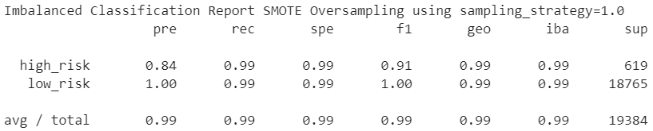
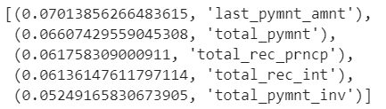

# **Machine Learning - Classification Analysis - Resampling**
## By Franklin Vaca

## **Resampling Questions:**
### **1: Which model had the best balanced accuracy score?** 

>
The naive random oversampling and the SMOTE Oversampling using sample strategy of 1, have the highest balanced accuracy score at: 0.996378. Both of these models had the same Balanced Accuracy Score. These models were better at predicting low risk loans that were actually low risk as well as high risk loans that were actually high risk.
 
>
The simple logistic regression model (without applying oversampling, undersampling or a combination) had the lowest balanced accuracy score. The application of oversampling techniques or a combination (SMOTEENN) were slightly more effective (0.99 vs .98) at increasing the balanced accuracy score than undersampling. 
 

*Balanced Accuracy Scores*

### **2. Which model had the best recall score?** 
>
The naive random oversampling, the SMOTE Oversampling (both of them:using sample strategy of 1 and 0.5) and the Combination (SMOTEENN) have the highest recall score at: 0.99. These for classification methods offered higher recall scores for predicting high risk loans than undersampling and the simple regression model (without any sampling technique). All the classification methods had the same recall score (0.99) for predicting low risk loans.
 
>
Oversampling classification methods had a slightly higher sensitivity (recall score) than undersampling specially when predicting high_risk loans (0.99 vs 0.98)  
 

*Imbalanced Classification Reports*

### **3. Which model had the best geometric mean score?** 
>
The imbalanced classification reports indicate that all the classification techniques used in the analysis had the same geometric mean score of 0.99, with the exception of the original simple logistic regression (without over or undersampling).
 
>
Since we need more decimal points to make a better assessment, the geometric_mean_score function was used to have more decimal points. The naive random oversampling and the SMOTE Oversampling using sample strategy of 1, have the highest geometric mean score at: 0.9936. It can be concluded that all the classification techniques used had a geometric mean score of 0.99 with Random Oversampling and SMOTE having slight advantage over the rest.
 
>
The geometric mean (G-mean) is the root of the product of class-wise sensitivity. This measure tries to maximize the accuracy on each of the classes while keeping these accuracies balanced. (from: https://imbalanced-learn.org/dev/references/generated/imblearn.metrics.geometric_mean_score.html) 
 

*Geometric Mean Scores*

### **Resampling Analysis Appendix** 
>
Images of the confusion matrices of the models were included below as reference.
 
*Confusion Matrix*

# **Machine Learning - Classification Analysis - Ensemble Learning**
## By Franklin Vaca

## **Ensemble Learning Questions:**
### **1: Which model had the best balanced accuracy score?** 

>
The easy ensemble model has the highest balanced accuracy score at: 0.9316. The easy ensemble model was better at predicting low risk loans that were actually low risk as well as high risk loans that were actually high risk.. 

*Balanced Accuracy Scores*

### **2. Which model had the best recall score?** 
>
The random forest has the a perfect recall score (1.0) for low risk loans but the lowest recall for high risk loans (0.37). The easy ensemble model has a 0.92 recall score for high risk loans and 0.94 for low risk loans. Even though the random model is better at predicting true low risk loans it fails terribly at predicting high risk loans which is the main objective of the analysis. The easy ensemble has a much higher sensitivity (recall score) than random forest for predicting high risk loans (0.92 vs 0.37).  
 

*Imbalanced Classification Reports*

### **3. Which model had the best geometric mean score?** 

>
The easy ensemble has a higher geometric mean score than the random forest (0.93 vs 0.61) model. "For binary classification G-mean is the squared root of the product of the sensitivity and specificity. " (from: https://stats.stackexchange.com/questions/459695/geometric-mean-for-binary-classification-doesnt-use-sensitivity-of-each-class ). Specificity is the proportion of actually negative samples (0's) that were correct. A model with no False Positives has perfect specificity. The specificity of the random forest model is 0.37 which is the lowest and drastically decreases its geometric mean score . The random forest model predicted 64 (false positive) as low risk loans that were actually high risk, which is much higher than the predicted high risk loans that were actually high risk (true negatives). In other words the prediction of false positives was much higher than true negatives which affected the specificity of the model and the geometric mean score of the random forest model.
 

### **4. What are the top three features?** 

>
The top three features that have the highest importance to determine the risk of the loan are: Amount of the last payment (0.0701), total payment (0.066) and total principal received (0.061).
 

*Top Five Features Importances*

### **Ensemble Learning Analysis Appendix** 
>
Images of the confusion matrices of the models were included below as reference.
 
*Confusion Matrix*

